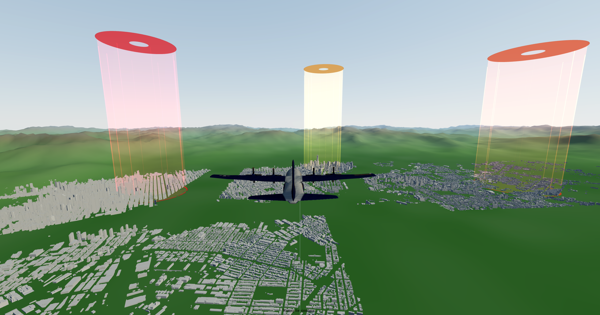

# C-130 Flight Simulator with Control Barrier Functions



## Overview

This project implements a simplified 3D flight simulator inspired by a C-130-class aircraft, with a focus on safety-critical control using Control Barrier Functions (CBFs).

The system allows manual control of the aircraft while automatically enforcing safety constraints through real-time control filtering.

---

## How to Use

### 1. Unzip the Project

cd project_root__folder
```

### 2. Compile

```bash
clang++ -std=c++17 -O2 -I include src/main.cpp src/aircraft.cpp src/logger.cpp src/visualizer.cpp -o sim
```

### 3. Run

```bash
./start.sh
```

This will:

* Launch the simulation
* Start the visualization server
* Open the viewer in your browser

---

## Dynamics Model

The aircraft state is defined as:

* Position: (x, y, z)
* Orientation: yaw, roll, pitch
* Speed: v

### Control Inputs

* `roll_cmd`
* `pitch_cmd`
* `throttle_cmd ∈ [0, 1]`

### State Evolution

* Roll:
  roll ← roll + kRoll (roll_cmd − roll) dt

* Pitch:
  pitch ← pitch + kPitch (pitch_cmd − pitch) dt

* Speed:
  v ← v + kThrottle (v_target − v) dt

---

## Safety via Control Barrier Functions

### Altitude Constraints (HOCBF)

* Floor: y ≥ 1000 m
* Ceiling: y ≤ 3000 m

Pitch is filtered to satisfy:
ḧ + α₁ ḣ + α₀ h ≥ 0

---

### No-Fly Zone Avoidance

* Circular zones in (x, z)
* Roll is adjusted using predictive sampling
* Ensures:
  ḣ + α h ≥ 0

---

## Controls

* Arrow keys → Pitch / Roll
* W / S → Throttle
* Q → Quit

---

## Simulation Details

* Time step: 0.01 s (100 Hz)
* Real-time execution
* Logs written to `flight_log.csv`
* Viewer updated via `state.json`

---

## Verification

* Cannot descend below 1000 m
* Cannot climb above 3000 m
* Cannot enter no-fly zones

---

## Design Highlights

* Real-time control filtering using CBFs
* Predictive avoidance (not reactive clipping)
* Clean separation of simulation and visualization

---

## Limitations

* Simplified dynamics
* No full 6DOF model
* No disturbance modeling

---

## Future Improvements

* QP-based CBF solver
* Multi-agent simulation
* Wind/turbulence

